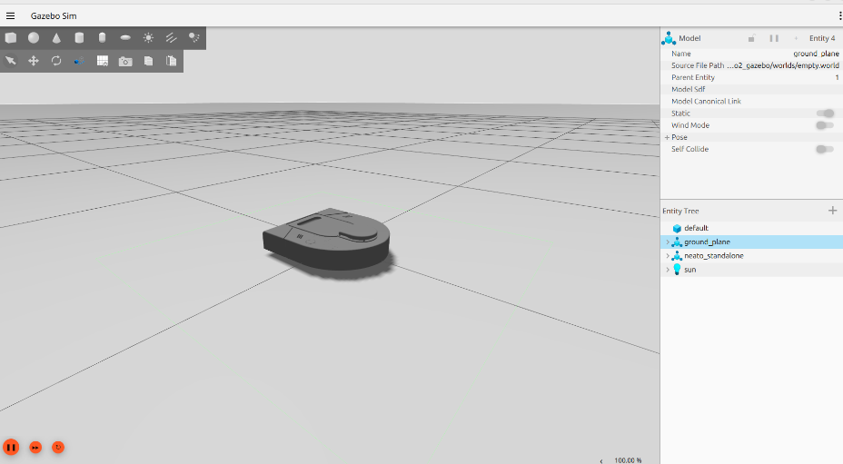

This document will help you launch and use Neato simulation tools used in this class.  Before going through these instructions, make sure that you have already <a href="../How to/setup_your_environment">setup your computing environment</a>. This is a good page to use to test your setup if you aren't near a Neato!

We will use the simulator for in-class activities and as part of project development workflow. Simulation is an incredibly useful development tool, since deploying on robots can be _expensive_ in the real world. Practicing running, designing, and using simulation tools can be a powerful skill in industry, and can be a learning outcome you can focus on for this class.

# What is a Robot Simulator?

Without getting into too much detail, a robot simulator is software that simulates a robot interacting with some sort of environment.  As such, a simulator will typically provide the following major functionality.

* It will provide a means to specify the physical layout of the robot's environment (e.g., the location of obstacles, the physical properties of various surfaces).
* It will provide a means to specify a robot model (e.g., the robot's sensors, actuators, mass, inertia, etc.).
* It will provide simulated sensor data (i.e., what *would* the robot's sensors have reported if the robot were in a particular environment in a particular location).
* It will provide a means to execute simulated motor commands (i.e., it will let you tell the robot to move).
* It will provide a way to visualize the simulation state (e.g., as a graphical rendering).

One nice thing about ROS2 is that the usage of a publish and subscribe structure provides a very clean separation between the robot itself and code that you will write to program the robot.  For instance, you can write a motor control node that sends commands to the topic ``cmd_vel``.  This program can work with any real or simulated robot so long as the robot or simulator subscribes to the ``cmd_vel`` topic and executes the appropriate motor command in response to the messages it receives (e.g., the motor command might involve moving a real motor or it might involve moving a simulated robot).

## Differences with Visualizers (e.g., RViz)

Oftentimes students will be confused as to what the difference is between a robot visualizer and a robot simulator. Robot visualizers, like RViz, allow you to visualize a robot's sensor data _but does not emulate anything about the robot/world physics_. As such, RViz has a graphical interface that can look a lot like the graphical interface of the robot simulator.  In contrast, RViz does not have any means to execute a simulated motor command or generate simulated sensor data: it can only display the data that it receives. We will be using Gazebo Harmonic for robot simulation in this class.


# Starting and Using the Simulator

You can launch your robot in many different simulated worlds.  To start your robot in an empty world environment, run the following command:

```bash
ros2 launch neato2_gazebo empty_world.py
```

<p>If all went well, you will see a bunch of output stream by and a visualization that looks like the following.</p>

<p align="center">

</p>

To launch a robot in an obstacle course environment, you can run the following command:


```bash
ros2 launch neato2_gazebo neato_gauntlet_world.py
```

Which should look like this when the simulator starts:

<p align="center">

</p>

If you ever want to just launch Gazebo Harmonic directly, you can use the following command in terminal:


```bash
gz sim
```

Once the simulation is launched, you can run any other nodes that you would when interacting with a physical Neato. To test this, in a new terminal, you can run:


```bash
ros2 run teleop_twist_keyboard teleop_twist_keyboard
```

And you should see your simulated robot move as you use the keyboard to produce `/cmd_vel` messages.


# Understanding the Gazebo Harmonic Graphical Interface

The Gazebo website has a [guide on using Gazebo's graphical interface](https://gazebosim.org/docs/harmonic/gui/).In fact, all of the documentation here is worth a read!


# Available Topics

Like for the real robot, launching the simulator will provide you access to robot data transmitted over topics. Due to the interoperability of ROS2, the topics (and data types) available for simulation are essentially identical to those when you connect to the physical robot.

This documentation gives the high-level purpose of each topic.  To explore more, you can use the following command to get more information.

```bash
$ ros2 topic info /topic-name
```

If you want to know more about a message you see in the output of ``rostopic`` you can use the following command (note that the ``-r`` flag can be ommitted if you want to the mesasges nested within the top-level message to be expanded).

```bash
$ ros2 interface show msg_package_name/msg/MessageName
```

### ``accel``

This is the linear acceleration of the Neato in meters per second squared along each axis of the Neato.  This same information is included in the ``imu`` topic (although there it is nested further).

### ``bump``

This topic contains four binary outputs corresponding to each of the Neato's four bump sensors.  In the simulator, all bump sensors are either on or off (no differentiation is made between the bump sensors).

### ``bumper``

This is an internal topic to Gazebo.  If you are curious, you can look at the output as you run into something, but you don't need to worry about it in this class.

### ``camera/image_raw``

These are the images coming from the simulated camera.

### ``clock``

This is the simulator clock.  This is useful for executing commands based on elapsed time.  It is preferable to use this clock rather than the wall clock (your computer's system clock) since the simulation might not run at the same rate as realtime.  You don't typically want to subscribe to this topic directly.  Instead, if you have a ``rclpy.node.Node`` subclass (common), you can grab the current time through ``self.get_clock().now()``.

### ``cmd_vel``

You publish to this topic to set the robot's velocity.  The ``linear.x`` direction sets forward velocity and ``angular.z`` sets the angular velocity.

### ``imu``

This is the simulated IMU (intertial measurement unit).  It has linear acceleration and angular velocity.

### ``joint_states``

These tell you the total rotation (in radians) of each wheel.  Note that this is a "ground truth" value, meaning that it is not estimated from sensors but instead comes from Gazebo.  In a scenario with a real robot, you wouldn't have access to this.

### ``odom``

This tells you the robot's position relative to its starting location as estimated by wheel encoders.  You can get this information more flexibly through the ROS2 tf module, but this is a relatively easy way to get started.

### ``projected_stable_scan``

This provides the LIDAR measurements (think of these as detected obstacles or objects from the environment).  In contrast to the ``scan`` topics, these measurements are in the odometry frame (rather than relative to the robot) and are in Cartesian rather than polar coordinates.  There is no need to use this topic, but for some applications it is nice to have.

### ``rosout``

This is a topic provided by ROS.  See the [ROS docs on ``rosout``](http://wiki.ros.org/rosout)for more information.

### ``scan``

These are the measurements of the Neato's LIDAR.  See the documentation for the physical Neato for more details.


### ``stable_scan``

These are the measurements of the Neato's LIDAR.  For the physical Neato, this will have a different time stamp than ``scan``, but for the simulated Neato it is identical to the ``scan`` topic.  See the documentation for the physical Neato for more details.

### ``tf``

This is provided by the [tf2 module](https://docs.ros.org/en/jazzy/Tutorials/Intermediate/Tf2/Introduction-To-Tf2.html) to update the relationship between various coordinate systems. Typically, you don't subscribe to it directly but instead use the Python tf module.

### ``tf_static``

This is provided by the [tf2 module](https://docs.ros.org/en/jazzy/Tutorials/Intermediate/Tf2/Introduction-To-Tf2.html) to update the relationship between various coordinate systems. Typically, you don't subscribe to it directly but instead use the Python tf module.

# Using Rviz with the Simulator

Once the simulator is running, you can launch ``rviz2`` in a new terminal and interact with it the same way you would for the physical Neato.

# Shutting Down the Simulator

Go to the terminal where you launched the simulator and hit control-c. The process should end cleanly and any simulator windows should close. 

# Creating Your Own Simulation Environments

If you want to create your own world (for a project or to learn more about the tool), please read the [Gazebo Harmonic documentation](https://gazebosim.org/docs/harmonic/sdf_worlds/). The video how-to guide at the bottom of this page might be particularly helpful! 
