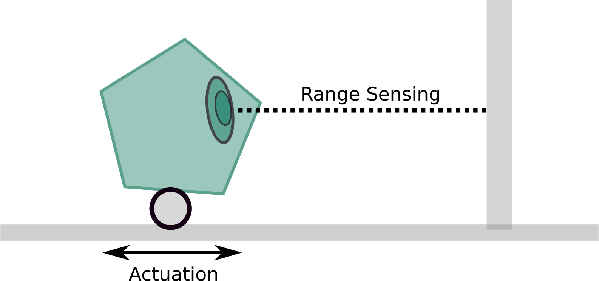
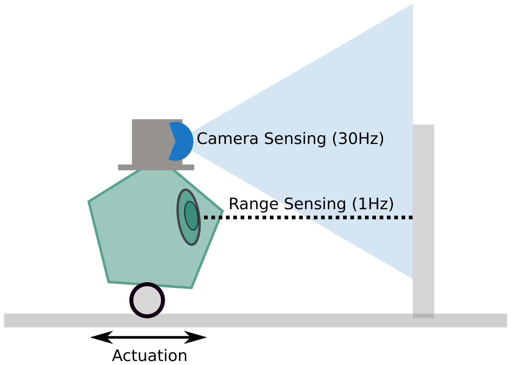

## Today
* First Day Debrief
* [About Modern Robotics: A Glossary](https://docs.google.com/presentation/d/1pXEyKQvti7Vg1wR6l2MFnddXxUgTpYjwVJnR7uMjqlo/edit?usp=sharing)
* Fundamental ROS Concepts + Teleoperation


## For Next Time
* Submit your [YOGA Phase 0 assignment](../assignments/class_yoga) (Due Sept 7th at 7PM)
* Find a partner for the [RoboBehaviors and FSMs](../assignments/warmup_project) and get started. Please add yourselves to a team in Canvas.
  * It is recommended that by the next class you complete: making your RoboBehaviors package and creating a node that can drive the Neato.
* Get started on the [Broader Impacts](../assignments/broader_impacts) assignment (Due Sept 29th at 7PM).


## First Day Debrief
Thanks everyone for filling in the course entrance survey; we really appreciate your feedback so far and will be aligning our office hours and resources to the responses. Some key things that came up during the survey to share with you all:
* **What's Exciting** -- the opportunity to be creative in a final project, formal introductions to various robotics topics and skills, simulation development, and working with the Neatos (and other platforms)
* **What's Concerning** -- developing appropriate project scopes, translating concepts to projects in a meaningful way, previous experience with software development translating to this class, learning a new software development environment
  * The teaching team is here to help with project formulation, as much as helping execute on projects. There is flexibility built into the Machine Vision and Final Projects to also re-adjust goals partway through projects if scoping needs to change for whatever reason.
  * The hopeful goal of the State Estimation and Localization project is to demonstrate how to take some mathematical and computational concepts in robotics, and translate them to our specific Neato platforms. This "translation scaffolding" combined with in-class coding exercises throughout the semester, is designed to assist with concept-to-application in projects. 
  * The first project of the course is an opportunity for everyone to start experimenting with the software tools we have in the class, and in-class activities will be heavily oriented around building good software practice. Now is a great time to come to office hours or reach out to the teaching team if there are particular areas in software development that you are looking to improve upon before we start kicking off some of our algorithms work. 
  * We don't want interfacing with the Neatos to be a blocker in this class, and will work towards keeping the hardware fresh. That doesn't mean you won't spend a lot of time with the robots debugging though -- one of the things we'll see in this class is the gap between theory, simulation, and hardware deployment.
* **Exposure to Robotics** -- for many folks robotics is a new area of exploration even if they have had significant software experience previously, other folks may have intersected with robotics in high school through team projects or have completed robotics or robotics-adjacent projects during other courses, and many others have engaged with the mechanics of robots and are just dipping into the software side.
  * We can and should lean on each other in this class -- if you feel strong in your background, share with others! If you're learning and have questions, chat with your colleagues in this class! This is a nice opportunity for everyone to teach and learn across the different facets of the class.
* **Broader Impacts Themes** -- The top six themes folks selected in the survey as being of particular interest included the _intersection of AI with robotics_ (65%), _automation and labor_(58%), _policy development, regulation, and licensing_ (35%), _research and venture funding for robotics_ (35%), _human-robot collaboration, cooperation, and care_ (30%), and _designing for intended use_ (30%). We invite you to keep these in mind as you select your Broader Impacts projects, and we'll be visiting these topics in class discussions ahead!
* **Peer Goals** -- shared themes among people in the class include an interest in understanding the intersection of programming and hardware, learning more about what "robots" are and what skills are involved in working with them, developing portfolio projects, considering possible future opportunities in robotics (from a professional perspective), and working on fun and healthy team projects.
  * Something we absolutely want to support in this class are conversations about career prep (curricular strategy, crafting useful projects, pointing to more skill resources, introducing the landscape of post-grad opportunities, etc.) as they might be related to robotics, robotic-software, or robotics-adjacent interests. Please feel free to investigate these topics through your projects and discuss with colleagues and the teaching team in-class, on the Discord, or at office hours!


## About Modern Robotics: A Glossary
"Robotics" as a field of study or industry encompasses a _huge_ range of topics, themes, and systems. To be a roboticist in practice is to be someone who can appreciate the complexity of sociotechnical systems, can collaborate with domain experts across various technical / applied fields, and who generally specializes in a particular facet of a robotic system.

Here is a brief tour of terms used to describe various facets of the field of robotics and resources to learn more! [Slides](https://docs.google.com/presentation/d/1pK8_edA4yxxAAijK96Wv3OGaj6YXxH4RwtO8fbtWEQE/edit?usp=sharing)

After seeing some of this terminology, is there any particular field that particularly strikes your curiosity and you might like to investigate further in one of the class projects?


## Understanding ROS
Before we write any code, let's take a step towards better understanding what our goals are when developing software for any robot for which we have some purpose in mind.

Our robot itself consists of a chassis of some form, on which sensors and actuators are integrated. Some number (can be greater than 1) of computers are also integrated onto the robot, connected to the data links from sensors and controller links to actuators. On these computers, software is running algorithms that convert sensor information to actuator commands.

**Think, Pair, Share Activity:** Imagine that you have a robot mounted on a linear rail with a single-point range finder and a single actuator that moves it along the rail. You want the robot to get closer to an object that is further than 50cm away, but run away from objects that get closer than 5cm. How might you imagine writing and formatting a function or script that uses the range finder data to control the linear actuator?

<p align="center">

</p>

Perhaps the most straightforward approach to this is to write a function that operates serially: for every sensor measurement taken in, a command is sent out. But this breaks down quickly when we think about relatively modest modern systems:
* What if the robot has multiple sensors, which operate on different clocks?
* What if the robot has multiple actuators?
* What if the robot has multiple tasks that run at different computational speeds?

**Think, Pair, Share Activity:** What would need to change about the pseudocode you wrote to allow for the robot to have an additional sensor, like a camera, operating at a different sensing frequency and used to help control the system? What are some challenges you might encounter?

<p align="center">

</p>

To arbitrate between the many sensors, actuators, and algorithms that a robot may be running, a _communications middleware_ is a typical solution. ROS2 is one such middleware. We can think of ROS2 like a very clever post office, which can take data in and distribute it to all the different places it needs to go.

The lexicon of this post office (that we will be using for now), is to _publish_ and _subscribe_ to data called _topics_ that consist of various _message types_:
* Publishers create some data package (_topic_) for dissemination (for instance, a sensor "node" may produce the range-finder measurements as a `/range` topic)
* Subscribers await publications on certain topics, listening for published data. When they receive that data, they may do some work on it (for instance, an algorithm "node" which listens for publications of `/range` may use new data to determine whether an object should be chased or run-away from)
* Nodes (discrete algorithms) can _both publish and subscribe to topics_, which is where the flexibility of ROS2 really shines

In the rest of today's exercises, we will write our first ROS2 package that will create a publisher and subscriber pair.


## Coding Exercise: Dissecting a ROS Node
Before we get started writing a bunch of code, let's take some time to look at where we're headed. Read through the code sheets printed and given to you. With the folks at your table, draw the publisher-subscriber architecture that is described by the code. What's going on here? What looks familiar? What is confusing? Feel free to annotate the code, ask questions of the teaching team, and use your online resources!


## Coding Exercise: Creating our first ROS Package

Sample solutions for these exercises can be found in the [class_activities_and_resources Github repo](https://github.com/comprobo26/class_activities_and_resources).  If you'd like to organize your class work as a GitHub repo, we suggest you fork the repo ``class_activities_and_resources``. Once forked, add the upstream:
```bash
$ cd ~/ros2_ws/src/class_activities_and_resources
$ git remote add upstream https://github.com/comprobo26/class_activities_and_resources
$ git pull upstream main
```

A set of recorded screens with narration of the coding exercise can also be watched here:
* [Part 1: Creating a ROS package](https://youtu.be/hkbq6FW_vho)
* [Part 2: Writing a Publisher Node](https://youtu.be/fJvi2b9UL9o)
* [Part 3: Messages in ROS and Finishing the Publisher Node](https://youtu.be/KyisKUGxoKM)
* [Part 4: Writing a Subscriber Node](https://youtu.be/n8X8GGykuvc)

### Creating a ROS package

Let's write our code today in a package called ``in_class_day02``

```bash
$ cd ~/ros2_ws/src/class_activities_and_resources
$ ros2 pkg create in_class_day02 --build-type ament_python --node-name send_message --dependencies rclpy std_msgs geometry_msgs sensor_msgs
```

This command will create a Python package for you (indicated by `--build-type ament_python`) and a node called ``send_message`` that will leverage `rclpy` and `std_msgs`, `geometry_msgs`, and `sensor_msgs` utilities. The node should be located in the following location:

```bash
~/ros2_ws/src/class_activities_and_resources/in_class_day02/in_class_day02/send_message.py
```

By default it will look like this:

```python
def main():
    print('Hi from in_class_day02.')


if __name__ == '__main__':
    main()
```

### Building and Running your Node

You can build your node by running:

```bash
$ cd ~/ros2_ws
$ colcon build --symlink-install
```

What's going on in this command? [Colcon](https://colcon.readthedocs.io/en/released/) is a build system wrapper designed for ROS workspaces. A workspace is a collection of software packages and their build/log/install artifacts for a system. A build system compiles software packages (typically located in the `\src` folder of a workspace) and creates those build/log/install artifacts that ultimately lets a software package run on a machine. Colcon is a convenience wrapper for ROS that can deal with Python, C++/C, and mixed-compilation packages that are common in robotics projects. If you want to learn more about legacy systems, you might be interested in [catkin](http://wiki.ros.org/catkin/workspaces), [cmake](https://cmake.org/), and [make](https://www.gnu.org/software/make/).

What does ``--symlink-install`` do?  A [symlink](https://en.wikipedia.org/wiki/Symbolic_link) is a special type of file that points to another file.  In this case we will have a special file in our ``install`` directory that points to our Python script in our ``src`` directory.  In this way, we can modify the Python script ``send_message.py`` and run the modified ROS node without constantly running ``colcon build``.  To see the symlink run the following command.

```bash
$ ls -l ~/ros2_ws/build/in_class_day02/in_class_day02

lrwxrwxrwx 1 parallels parallels 108 Sep  5 20:14 /home/parallels/ros2_ws/build/in_class_day02/in_class_day02 -> /home/parallels/ros2_ws/src/class_activities_and_resources/in_class_day02/in_class_day02
```
Notice how the ``->`` sign indicates a pointer (symlink) from the ``build`` directory back to the ``src`` directory. From the perspective of rapid prototyping, this is one advantage of using languages like Python that don't require compilation in order to run. If we were writing nodes in C++/C, we would need to re-build our project every time we made an edit.

In order to run the node, first [source](https://www.techrepublic.com/article/linux-101-what-does-sourcing-a-file-mean-in-linux/) the ``install.bash`` script and then use ``ros2 run`` (Hint: try using tab completion when typing in the package and node names)
```bash
$ source ~/ros2_ws/install/setup.bash
$ ros2 run in_class_day02 send_message
```
Sourcing is a bash command that lets an executable use references located specially within a script (for instance, system variables, system pointers, background processes, etc. can be defined and deployed in a script). If you did not source your `setup.bash` after making changes, then you will likely encounter an error that prevents you from running your node (try it out by making a modification to a package and not sourcing sometime, so you can see what the error might look like!).

### Creating a Skeleton ROS Node

In order for your Python program to interface with ROS, you have to call the appropriate functions.  The easiest way to do this is by creating a subclass of the ``rclpy.node.Node`` class ([Documentation on rclpy](https://docs.ros2.org/latest/api/rclpy/api/node.html) will likely be helpful to familiarize yourself with!). If you are a bit rusty on your Python object-oriented concepts, take a look back at your notes from SoftDes (also let us know if you have a favorite resource for this). Taking the code that was automatically created in the ``ros2 pkg`` step and converting it into a ROS node, would look like this:

```python
""" This script explores publishing ROS messages in ROS using Python """
import rclpy
from rclpy.node import Node

class SendMessageNode(Node):
    """This is a message publishing node, which inherits from the rclpy Node class."""
    def __init__(self):
        """Initializes the SendMessageNode. No inputs."""
        super().__init__('send_message_node')
        # Create a timer that fires ten times per second
        timer_period = 0.1
        self.timer = self.create_timer(timer_period, self.run_loop)

    def run_loop(self):
        """Prints a message to the terminal."""
        print('Hi from in_class_day02.')

def main(args=None):
    """Initializes a node, runs it, and cleans up after termination.
    Input: args(list) -- list of arguments to pass into rclpy. Default None.
    """
    rclpy.init(args=args)      # Initialize communication with ROS
    node = SendMessageNode()   # Create our Node
    rclpy.spin(node)           # Run the Node until ready to shutdown
    rclpy.shutdown()           # cleanup

if __name__ == '__main__':
    main()
```

As before, you can run the node using ``ros2 run``

```bash
$ ros2 run in_class_day02 send_message
```

You will now have to use ``ctrl-c`` to stop execution of your node.  You should see the string ``Hi from in_class_day02`` print repeatedly onto the console.

### Creating ROS Messages in a Python Program

ROS messages are represented in Python as objects.  In order to create a ROS message you must call the ``__init__`` method for the ROS message class.  As an example, suppose we want to create a ROS message of type ``geometry_msgs/msg/PointStamped``.  The first thing we need to do is import the Python module that defines the ``PointStamped`` class.  The message type ``geometry_msgs/msg/PointStamped`` indicates that the ``PointStamped`` message type is part of the ``geometry_msgs`` package.  All of the definitions for messages stored in the ``geometry_msgs`` package will be in a sub-package called ``geometry_msgs.msg``.  In order to import the correct class definition into our Python code, we can create a new Python script at ``~/ros2_ws/src/class_activities_and_resources/in_class_day02/in_class_day02/send_message.py`` and add the following line to the top of our ``send_message.py`` script.

```python
from geometry_msgs.msg import PointStamped
```

Now we will want to create a message of type PointStamped.  In order to do this, we must determine what attributes the PointStamped object contains.  In order to do this, run

```bash
$ ros2 interface show geometry_msgs/msg/PointStamped
# This represents a Point with reference coordinate frame and timestamp

std_msgs/Header header
	builtin_interfaces/Time stamp
		int32 sec
		uint32 nanosec
	string frame_id
Point point
	float64 x
	float64 y
	float64 z
```

If we look at the lines that are unindented (aligned all the way to the left), we will see the attributes that comprise a ``PointStamped`` object.  These attributes are header (which is of type ``std_msgs/msg/Header``) and point (which is of type ``geometry_msgs/msg/Point``).  The indented lines define the definition of the ``std_msgs/msg/Header`` and ``geometry_msgs/msg/Point`` messages.  To see this, try running ``$ ros2 interface show`` for both ``std_msgs/msg/Header`` and ``geometry_msgs/msg/Point``.

In order to create the PointStamped object, we will have to specify both a ``std_msgs/msg/Header`` and a ``geometry_msgs/msg/Point``.  Based on the definitions of these two types given by ``$ ros2 interface show`` (output omitted, but you can see it in a slightly different form above), we know that for the ``std_msgs/msg/Header`` message we need to specify seq, stamp, and frame_id. It will turn out that we don't have to worry about the ``seq`` (it will automatically be filled out by the ROS runtime when we publish our message), the stamp field is a ROS time object (see this tutorial), and the ``frame_id`` field is simply the name of the coordinate frame (more on coordinate frames later) in which the point is defined.  Likewise, the ``geometry_msgs/msg/Point`` object needs three floating point values representing the $$x$$, $$y$$, and $$z$$ coordinates of a point.  We can create these two messages using the standard method of creating objects in Python.  In this example we will be using the keyword arguments form of calling a Python function which will make your code a bit more robust and a lot more readable.  First, we add the relevant import statements:

```python
from std_msgs.msg import Header
from geometry_msgs.msg import Point, PointStamped
```

Now we can define the header and point that will eventually compose our ``PointStamped`` message.  Let's put this code in the ``run_loop`` function so we can publish the message each time ``run_loop`` is called.

```python
my_header = Header(stamp=self.get_clock().now().to_msg(), frame_id="odom")
my_point = Point(x=1.0, y=2.0, z=0.0)
```

Now that we have the two fields required for our PointStamped message, we can create it.

```python
my_point_stamped = PointStamped(header=my_header, point=my_point)
```

To see what our resultant message looks like, we can print it out:

```python
print(my_point_stamped)
```

This will produce the output:

```bash
geometry_msgs.msg.PointStamped(header=std_msgs.msg.Header(stamp=builtin_interfaces.msg.Time(sec=1662424018, nanosec=755100091), frame_id='odom'), point=geometry_msgs.msg.Point(x=1.0, y=2.0, z=0.0))
```

> Note that instead of creating the two attributes of PointStamped in separate lines, we can do everything in one line as:
```python
my_point_stamped = PointStamped(header=Header(stamp=self.get_clock().now().to_msg(),
                                              frame_id="odom"),
                                point=Point(x=1.0, y=2.0, z=0.0))
```

In order to do something interesting, let's publish our message to a topic called ``/my_point``

First, we create the publisher in our ``__init__`` method by adding the following line to the end of that function.
```python
self.publisher = self.create_publisher(PointStamped, 'my_point', 10)
```

You can publish ``my_point_stamped`` by adding the following code to the end of your ``run_loop`` function

```python
self.publisher.publish(my_point_stamped)
```

Try running your code!

How can you be sure whether it is working or not?  Try visualizing the results in rviz.  What steps are needed to make this work?


### Callbacks

[Callback functions](https://en.wikipedia.org/wiki/Callback_(computer_programming)) are a fundamental concept in ROS (and we just used them to create our timer whether we knew it or not).  Specifically, they are used to process incoming messages inside a ROS node once we have subscribed to a particular topic.  Let's write some code to listen to the message we created in the previous step.

First, let's create a new ROS node in a file called ``receive_message.py`` in the directory ``~/ros2_ws/src/class_activities_and_resources/in_class_day02/in_class_day02``.  We'll start out with the standard first line as well as a header comment, import the correct message type, and initialize our ROS node:

```python
""" Investigate receiving a message using a callback function """
import rclpy
from rclpy.node import Node
from geometry_msgs.msg import PointStamped

class ReceiveMessageNode(Node):
    """This is a message subscription node, which inherits from the rclpy Node class."""
    def __init__(self):
        """Initializes the ReceiveMessageNode. No inputs."""
        super().__init__('receive_message_node')

def main(args=None):
    """Initializes a node, runs it, and cleans up after termination.
    Input: args(list) -- list of arguments to pass into rclpy. Default None.
    """
    rclpy.init(args=args)         # Initialize communication with ROS
    node = ReceiveMessageNode()   # Create our Node
    rclpy.spin(node)              # Run the Node until ready to shutdown
    rclpy.shutdown()              # cleanup

if __name__ == '__main__':
    main()
```

In order to run the node, we have to add it to our ``setup.py`` file, which is located in ``~/ros2_ws/src/class_activities_and_resources/in_class_day02/setup.py``.  We can modify the file as follows.

```python
    entry_points={
        'console_scripts': [
            'send_message = in_class_day02_solutions.send_message:main',
            'receive_message = in_class_day02_solutions.receive_message:main',
        ],
    },
```

Once you've modified ``setup.py``, you'll need to do another ``colcon build``.

```bash
$ cd ~/ros2_ws
$ colcon build --symlink-install
```

You can now run your node using the command:
```bash
$ ros2 run in_class_day02 receive_message
```

As of now, it won't do anything.

Next, we will define our callback function.  Our callback function takes as input a single parameter which will be a Python object of the type that is being published on the topic that we subscribe to.  Eventually we will be subscribing to the topic ``/my_point`` which means that we will be writing a callback function that handles objects of type ``geometry_msgs/PointStamped``.  As a test, let's make our callback function simply print out the header attribute of the PointStamped message.  This function should be added as a method of our ``ReceiveMessageNode`` class.

```python
def process_point(self, msg):
    """Takes msg input and prints the header of that message."""
    print(msg.header)
```

Next, we must subscribe to the appropriate topic by adding this line to the ``__init__`` method.

```python
self.sub = self.create_subscription(PointStamped, 'my_point', self.process_point, 10)
```

The ROS runtime will take care of calling our ``process_point`` function whenever a new message is ready!  There is nothing more we have to do to make this happen!

Go ahead and run your ROS node ``receive_message`` and see what happens!  (make sure your ``send_message`` node is also running)

### Viewing the Results in RViz

We can open up rviz and visualize the message.  First, open rviz.

```bash
$ rviz2
```

Next, click ``add``, ``by topic``, and select your marker message.  Make sure to set the ``fixed frame`` appropriately.


## Going Further: Basic Behaviors [Start In Class; Finish for Homework]
First, some quick vocabulary:
* Trajectory: in robotics, this refers to a set of ordered coordinates in a context space that a robot can travel over. Example: for a mobile ground robot, a trajectory can refer to an ordered list of latitude-longitude coordinates on a map.
* Behavior: in robotics, this refers to a semantic action that a robot can take in a context space; this is more general than a trajectory. Example: move forward, drive in a square, follow a person.
* Controller: in robotics, this refers to an algorithm that, given a trajectory and a model of a robots form and function, can generate a set of actuator commands to execute the desired trajectory.

In our first project, we're going to be developing _behaviors_ for a robot to execute (and then chaining those behaviors together logically to create even more sophisticated behavior). For the purposes of our class, a robot can have different levels of sophisticated single behaviors:
* Fundamental: go forward, go backward, turn in place, turn in an arc, drive in a shape
* Basic: collision avoidance / safety stop
* Advanced: wall following, people following, obstacle avoidance

In this exercise, we invite you to start experimenting with writing programs for the Neato by choosing a fundamental behavior. Most of these behaviors require only to publish commands to the Neato (although fancier versions might take sensor input to improve quality of the behavior). "Open-loop" autonomy is a fundamental behavior in the sense that being able to give a set of rote commands for a robot to execute autonomously is a prerequisite for any more complicated "closed-loop" autonomy you may develop in the future. So we're going to start here.

Look at the [assignment description of driving in a shape](../assignments/warmup_project) and work on the following with folks at your table:

1) Sketch an outline of a ROS Node that could act as a driving-in-a-shape node. Do this on a whiteboard, not on a computer. Pay attention to:
  * What are the inputs/outputs to the node; what does this mean about callbacks, subscribers, and publishers?
  * What message types might you be expecting?
  * What aspects of the robot can you control?


2) After you have an outline, draw up the skeleton code for a Node on a computer (you can do this in the `in_class_02` package for now; don't forget to update your `setup.py`!), adding comments that capture your pseudocode. Make sure your skeleton code can compile and run as designed, before you start implementing all your logic.


3) Start implementing the elements of your pseduocode. Consider how you can test that your code is working along the way. For instance:
  * Are there places you can add strategic `print` statements?
  * Would logging a message through ROS be useful?
  * Do you want to make a publisher to transmit certain information that can be visualized in RViz?

