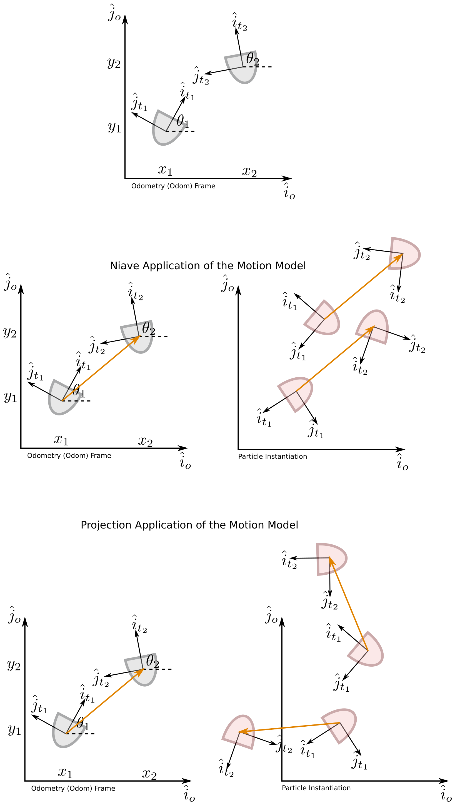

## Today

* The Intersection of AI and Robotics
* Bayesian Filtering (and the Particle Filter)
* Motion Models: Computing Relative Motion

## For Next Time
* Work on your [Broader Impacts](../assignments/broader_impacts) assignment (Due Sept 29th at 7PM).
  * We will have a [class discussion](https://canvas.olin.edu/courses/1070/assignments/20094) on Thursday Oct 1st.
    * You will be placed in groups and each person will have ~7 minutes to discuss their robots and artifacts with one another.
    * Every person will fill in a discussion feedback form for each person in their group; review the form on Canvas.
* Complete the [Particle Filter Conceptual Overview](../assignments/robot_localization) **due Friday October 2 by 7PM**
  * [Form a team on Canvas](https://canvas.olin.edu/courses/1070/groups#tab-1312); and work on the [Robot Localization project](../assignments/robot_localization)
  * Demos due on **Monday October 19 by Class**
  * Code + Writeups due on **Tuesday October 20th 7PM**
  * Reflection due by **Tuesday, October 27th 7PM**

## The Intersection of AI and Robotics
Throughout the second module, we will be taking a tour of topics the class flagged as mutually interesting areas to learn more about robotics applications and implications. 

First up, we're going to discuss the **intersection of AI and Robotics**. In your group, please fill out brief notes from your discussion using [this form](https://forms.gle/SGEzrjozjGuZzKiQA).

### Classifying Embodied AI Systems 
In a [seminal textbook on Artificial Intelligence](https://raw.githubusercontent.com/yanshengjia/ml-road/47cadb02faa756f85fd2f058e31221cc8223b97a/resources/Artificial%20Intelligence%20-%20A%20Modern%20Approach%20(3rd%20Edition).pdf), Stuart Russell and Peter Norvig divide the field of _intelligent autonomy_ across two axes: Thinking vs Acting; and Human-Like vs Rational.

Where do different robots or robotics disciplines fall along these lines? 

Let's consider the following robots, and map them on the 2x2 of Thinking-Acting and Human-Rational:

* At-home care and companion robots
* An autonomous planetary explorer
* A self-driving taxi
* Manufacturing-line arms
* Warehouse pack-and-stack robots
* Deaf-blind signing interface (e.g., [Tatum Robotics](https://tatumrobotics.com/))
* Automated solar installers
* Waste sorters
* Bipedal factory worker
* Your selected Broader Impacts Robot

After you've taken a pass at sorting these robots, pick one of the following two reflection questions and discuss with your table group:

1. What heuristics were you using to sort the robots? Did task, context, or something else matter the most in your sorting? Why or why not?
2. For your "Acting Humanly" robots, what are the key technical challenges that would need to be overcome in implementing these robots? What is shared and what is unique compared to the other categories?

### Implementing Embodied AI: Dealing with Novelty
Those of us familiar with the generative AI explosion of the last 4+ years know that apps like Chat-GPT, Claude, CoPilot, NotebookLM, and many more systems are trained on massive datasets of text, imagery, video, and audio in order to produce impressive pattern-predicted output for given prompts. For the casual conversation with an AI chatbot, the output can be uncannily human-like. 

But when have you seen these systems fail? What were you attempting to do or discuss with the genAI system when you started getting unusable, nonsensical, irrelevant, or simply strange output? 

**Novelty** in AI and robotics is the encountering of a scenario (rendered through measurement from a sensor or set of sensors) that is *outside of the distribution* of previously seen scenarios. Remember, many large-data AI systems are essentially very good *interpolators*, not *extrapolators*. 

While for large language models (LLMs), extremely niche topics may be the thing that finally trips up the chatbot, for embodied robotic systems, novelty is a much more common implementation hazard. Some reasons for that:

* Robots run in real-time with streaming measurements that for some arbitrary time horizon can be a unique sequence
* Robots may encounter many one-off scenarios that can get drowned out in standard training regimes as "noise"
* Robots are in the "real-world" with multi-agent (other robots, other people) complexities
* Every instantiation of a robot will have its own noise characteristic
* Some robotic tasks are literally predicated on the notion of novelty (e.g., planetary exploration robots)
* *What are some other reasons/scenarios?*

The 1-5% of self-driving that has yet to be "solved" can largely be chalked up entirely to the challenge of safely and responsibly handling novelty with the classical and modern ML and AI methods used under the hood. 

Pick one of the robots from the last part of the exercise, choose a "task" that would be appropriate for this robot to do, and discuss with your group the following:

1. What aspects of this task could lend themselves to generative AI or other large-data AI models? 
2. What aspects of this task would require dealing with novelty in typical use?
3. What are some of the ways you might suggest handling novelty when this system encounters it? (you could think about whether there are rules that could be encoded, prior knowledge that can be embedded in the system, safety features that would be installed, a different AI or ML toolkit that could be used outside of large-data training systems, etc.)
4. How would you prove that your robot would act safely when encountering a novel scenario?

## Bayesian Filtering and the Particle Filter
For your projects, you're implementing a particle filter, which is a subclass of algorithm under the more general category of _Bayesian filters_. A Bayesian filter is a recursive, or sequential, algorithm -- for localization, this means that the robot's state estimate is refined iteratively as observations or actions are taken.

At a high-level, the steps of a Bayesian Filter are:

1. Initialize with an estimate of the first pose
2. Take an action, and predict the new pose based on the motion model
3. Correct the pose estimate, given an observation
4. Repeat steps 2 and 3, ad nauseum (or until your robot mission is over)

We can compare that to the outline of a particle filter we reviewed last class:

1. **Initialize** Given a pose (represented as $$x, y, \theta$$), compute a set of particles.
2. **Motion Update (AKA Prediction)** Given two subsequent odometry poses of your robot, update your particles.
3. **Observation Update** Given a laser scan, determine the confidence value (weight) assigned to each particle.
4. **Guess (AKA Correction)** Given a weighted set of particles, determine the robot's pose.
5. **Iterate** Given a weighted set of particles, sample a new set.

### Prediction
During the prediction step, the current estimated pose of the robot is updated based on a _motion model_. The motion model captures how a control input may be mapped to the real world (what noise may be applied, for instance). Prediction will always increase the uncertainty we have about where the robot is in the world (unless we have perfect motion knowledge). Prediction asks: given where I think I am, where will I end up after I take this action?

### Correction
To reduce (or attempt to reduce) our uncertainty, we can look around us with an _observation model_ (which will also capture noise in our measurements). Correction asks: given what I am measuring, what is my likely pose based on my estimate of where I may be?

### The Particle Filter
A Bayesian filter, in its purest form, asks us to work with continuous probability distributions, and that is computationally challenging (nigh intractable) most of the time for practical robotics problems. The particle filter addresses these computational challenges by allowing us to _draw samples from our probability distributions_ and apply our prediction and correction steps to each of those samples in order to get an empirical estimate of a new probability distribution. In this way, the particle filter is a Monte Carlo algorithm, and leverages the law of large numbers to "converge" towards the optimal answer. (You can get a sense about why sampling works to find complex distributions by [playing with this applet](http://chi-feng.github.io/mcmc-demo/app.html?algorithm=GibbsSampling&target=banana)).

## Particle Filter Conceptual Overview
For the rest of class, you'll work in your project teams towards assembling your conceptual overview of your to-be-implemented particle filter. Be sure to [read over all of the assignment](../assignments/robot_localization) for this project before starting! There is some sample code you will want to run to get a sense of what the full project scope is!

Today, we'll focus on the prediction/motion model and next class we'll have an activity around the correction/observation model.

### Prediction: The Motion Model: Computing Relative Motion
One part of your particle filter will involve [estimating the relative motion of your robot between two points in time as given by the robot's odometry](https://github.com/comprobo26/robot_localization/blob/main/robot_localization/pf.py). 

Suppose you are given the robot's pose at time $$t_1$$, and then again a measure at $$t_2$$. What are some ways that you might compute the robot's change in pose between these times? What coordinate system(s) do you want to work in? Work with the folks around you to discuss your ideas; utilize your conceptual overview as a tool for the discussion!

> Note: Our [coordinate transforms activity](https://comprobo26.github.io/in-class/day06#coordinate-frames-and-coordinate-transforms-in-robotics) from a few classes ago might be inspirational for finding an approach here.

> Note: while probably not needed for dealing with 2D rotation and translation, the ``PyKDL`` library can be useful for converting between various representations of orientation and transformations (e.g., see [this section of the starter code](https://github.com/comprobo26/robot_localization/blob/main/robot_localization/helper_functions.py#L95)). This is also a helpful reminder -- there is skeleton and helper code you may want to be getting familiar with for your project...

#### One Approach: Homogenous Transformation Matrices
One way to think about the relationship between poses $$t_1$$ and $$t_2$$ is through simple translation and rotation. You might ask, why do we need to think about transformations at all? Can't I just take the difference between my poses and apply it directly to each of my particles? Consider the following diagram:

If we were to naively apply the difference between two poses to all of our particles, then we would end up moving those particles _in the exact same way, regardless of their orientation_ which is a relatively poor motion model. Instead, we need to apply the difference between the our poses _relative to the starting pose of our particle_, which we can do through a transformation. As a starting point, here is a [walkthrough of getting a rotation and translation matrix](https://docs.google.com/presentation/d/1VMTZQf_sgIdbWxB_owbgZ7GP6-WaUCh7tuRjvRU42tM/edit?usp=sharing) as well as a video version from Paul:

> Note: a mistake is made in this video when writing the origin offset (at 8:37 into the video). This doesn't change the substance, but watcher beware!

<iframe width="560" height="315" src="https://www.youtube.com/embed/x7mRC0Gowe8?si=movGSLBJvod5ad06" title="YouTube video player" frameborder="0" allow="accelerometer; autoplay; clipboard-write; encrypted-media; gyroscope; picture-in-picture; web-share" allowfullscreen></iframe>

