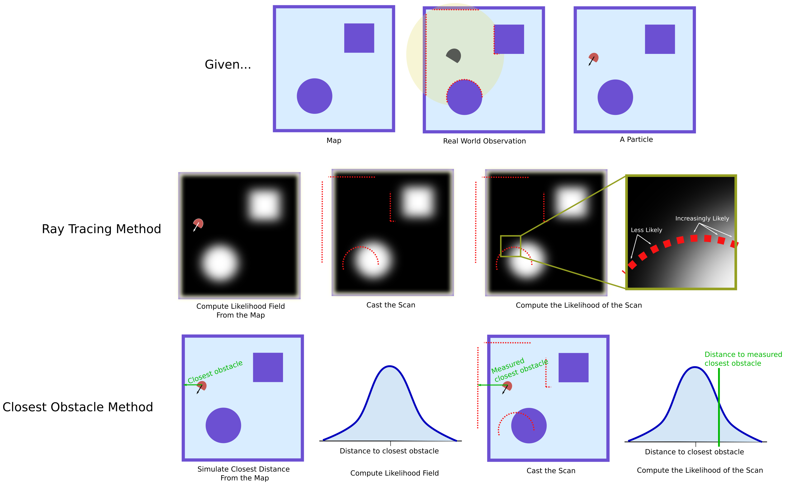

## Today
* Broader Impacts Part 1 Discussions
* Observation Models: Computing Likelihoods

## For Next Time
* Complete the [Particle Filter Conceptual Overview](../assignments/robot_localization) **due Friday October 2 by 7PM**
  * [Form a team on Canvas](https://canvas.olin.edu/courses/1070/groups#tab-1312); and work on the [Robot Localization project](../assignments/robot_localization)
  * Demos due on **Monday October 19 by Class**
  * Code + Writeups due on **Tuesday October 20th 7PM**
  * Reflection due by **Tuesday, October 27th 7PM**

## Broader Impacts Part 1 Discussions
In small groups of 5, we will go around and everyone will present their robot. Each person will have about 7 minutes to present and answer questions about the robot; everyone will then take [~2 minutes to fill in a survey form](https://canvas.olin.edu/courses/1070/assignments/20094) for feedback and self-reflection.

As a reminder, norms and expectations for these conversations we set as a group were:
* Respect the person, but challenge statements of fact
* Let people finish their thoughts, and let people speak
* Focus on discussion through a listening/learning mindset, rather than persuasion/debate
* Recognize that everyone is still learning
* Seek connections, rather than differences
* De aware of one's own biases/context, as well as others'

At the end of the discussion activity, everyone will have the opportunity to share with the whole class what the robot is that they selected.

## The Particle Filter Conceptual Overview
With the rest of class we will continue with studio time working on the particle filter conceptual overview. Please refer back to the Day 8 materials on computing motion models, and today spend some time thinking about the correction/observation model.

### Correction: The Observation Model: Likelihood Functions
One of the key steps of your particle filter is to compute the weight of each particle _based on how likely the sensor reading from the particle is, given the map_. There are tons of possible ways to compute this weight, but we recommend using a **likelihood field function**. Computing a likelihood field relies on the following steps:

1. Cast the sensor measurement into the world coordinate frame _relative to each particle's frame of reference_. 
2. Determine the closest obstacle in the map based on your sensor measurement location.
3. Compute the distance between your sensor reading and the closest obstacle.
4. Assign the likelihood of your sensor reading as the probability of your distance measurement + small stochastic noise.

The secret sauce here is in your closest obstacle identification, distance measurement probability, and your stochastic noise. There are many ways you can do this (two methods are shown in the illustration).

Let's consider the following:

#### ``update_particles_with_laser``
The first step is to determine how the endpoints of the laser scan would fall within the map *if the robot were at the point specified by a particular particle*.  You can do this by drawing some pictures and pulling out your trigonometry skills!

Next, you will take this point and compare it to the map using the provided ``get_closest_obstacle`` function (hint: you may want to be getting familiar with [this code](https://github.com/comprobo26/robot_localization/blob/main/robot_localization/occupancy_field.py)). Once you have this value, you will need to compute some sort of number that indicates the confidence associated with it.  Finally, you will have to combine multiple confidence values into a single particle weight.

#### Distance Confidence and Gaussian Distributions
A Gaussian (or normal) distribution is an incredibly useful probabilistic representation used widely in robotics; the reasons are:
* It has a closed-form solution for sampling
* It has a closed-form solution for assigning probability to a sample

We're interested in using a Gaussian to allow us to represent our confidence in the _distance measurement_ we compute in the previous step.  Setting the _variance_ term in our Gaussian distribution sets the effective confidence bounds we have on distance. This is a parameter you can set experimentally or through an optimization based methodology (if you had a lot of data to work with!)

#### Stochastic Noise
We know that our sensor readings are likely not perfect, and realistically, neither is the map. To account for some amount of error in those systems, we can add noise drawn from a Uniform distribution to our probability estimate.

#### Consult Probabilistic Robotics for more Detail
Consider consulting [Probabilistic Robotics](https://docs.ufpr.br/~danielsantos/ProbabilisticRobotics.pdf) for more details on using range-finders and likelihood functions (Specifically chapter 6.4).

#### Limitations
This method ignores the information embedded in ranges that "max out" the sensor reading (the vehicle is in empty space). This method also requires tuning a few parameters for your noise and confidence probability functions.

#### Combining Multiple Measurements
We typically have more than one range measurement at any time (that's the power of a lidar!), so we need to consider ways to combine the likelihood of each of our scans to get to one particle weight. Some options may be:
* Average the PDF values across the measurements
* Multiply the PDF values across the measurements
* Something in between?

It turns out these different approaches are all used in various forms in within the particle filters in ROS.  For example, there is a really weird way of combining multiple measurements in the [ROS1 AMCL package](https://github.com/ros-planning/navigation/blob/a9bc9c4c35a55390963db1357926ec461fcff24c/amcl/src/amcl/sensors/amcl_laser.cpp#L293). See this [pull request](https://github.com/ros-planning/navigation/pull/462) for some interesting discussion of this method.

In ROS2, it seems they still have the [old method](https://github.com/ros-planning/navigation2/blob/7be609e67c5b8f7e54b3bc2bcd53d41e652c494e/nav2_amcl/src/sensors/laser/likelihood_field_model.cpp#L124) but there is [another method](https://github.com/ros-planning/navigation2/blob/main/nav2_amcl/src/sensors/laser/likelihood_field_model_prob.cpp) that seems more principled (but may perform worse...).
