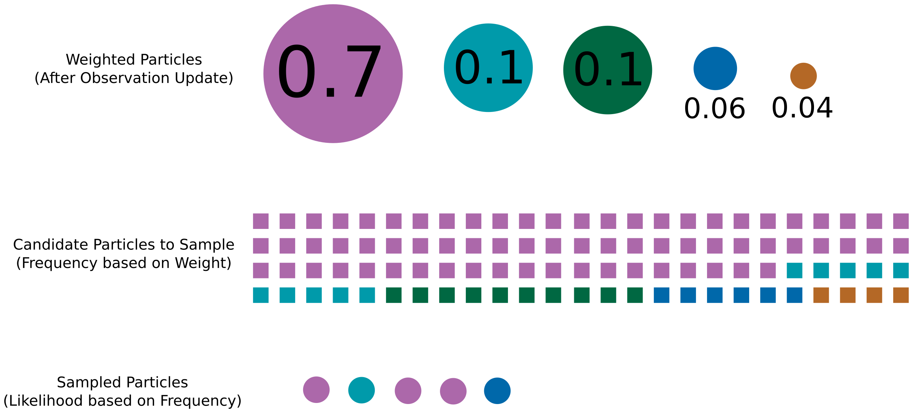

## Today
* AI and Robotics II Discussion: Reinforcement and Active Learning
* Re-Sampling and Pose Estimation
* Studio Time
 
## For Next Time
* Work on the [Robot Localization project](../assignments/robot_localization)
  * Demos due on **Monday October 19 by Class**
  * Code + Writeups due on **Tuesday October 20th 7PM**
  * Reflection due by **Tuesday, October 27th 7PM**
* Review your Broader Impacts Phase 1 feedback (emailed later today)

## AI and Robotics II - Dealing with Novelty
Last time we talked a bit about different ways of thinking about AI applied to robotic systems, and one challenge with directly implementing modern AI systems (e.g., genAI or large supervised models) on robots: novelty.

Within the realm of AI tools, there are two that have been widely adopted in robotics to attempt to address the novely problem: reinforcement learning and active learning. In this activity, we're going to learn a bit more about one of these techniques and consider their implications of use. 

To begin, in your table group, decide whether you would like to learn more about reinforcement learning or active learning; there will be an info exchange with another group so don't worry too much about missing out! Once you've made your decision, follow-along with the corresponding activity below.

### Reinforcement Learning
Let's start with a definition of reinforcement learning:
> An agent (robot) develops a policy for interacting with the world and performing some task, based on many interactions and receiving a penalty or reward.

In other words, RL for a robot is learning how to do a task through trial and error. For those interested, you can read a lot more [in this IJRR survey paper on the topic](https://www.ri.cmu.edu/pub_files/2013/7/Kober_IJRR_2013.pdf).

**Discussion Question 1**: Using at least one of the robots someone in your group is studying for the Broader Impacts project, determine how that robot would use RL to perform one of the key tasks of that robot. Consider the following:
  * What resources would the robot need? (e.g., access to a particular environment, person, object)
  * What would a trial look like for that robot? What metrics would determine when a trial was "over" and could be scored?
  * How would a robot label a trial as "successful" for that task?

In Robotic RL, there is a set of well known "curses" that make implementation challenging:
  * **The Curse of Dimensionality**: problems often scale exponentially in the number of dimensions to compute optimal policies over
  * **The Curse of Real-World Samples**: robot hardware is expensive (and typically one-off!), suffers from wear and tear, and is in a really noisy, partially observable environment
  * **The Curse of Abstraction and Model Uncertainty**: all models are wrong, some are useful, and it is challenging to know what "useful" means
  * **The Curse of Goal Specification**: we reward a robot for doing a "good job" but need to have a formalism for what the job is in order to assess it; but many jobs are complex and hard to define

**Discussion Question 2**: For the robot you've discussed, let's think about some of these curses:
  * Which of these curses do you think is most pressing for your robot, why?
  * How might you think about addressing this curse? Some things to consider: simulation tools, problem simplification, task subdivision and composition, embedding prior knowledge, etc.
  * What might the cost (in time, money, energy, people, task...) be for implementing this work-around for your robot? Do you think it would be worthwhile? Why or why not?

For robots operating in real-world conditions, there is almost always some risk of encountering something novel -- something outside of a training set or only rarely seen in that training set. A lot of [modern research in AI](https://news.mit.edu/2022/machine-learning-biased-data-0221) has focused on how to eliminate bias or leverage diversity in datasets for better performance. There are a lot of design considerations one needs to make as a software engineer and a robot operator to decide what method will be best for a particular system.

**Discussion Question 3**: Finally, let's consider the implications of training your robot with RL systems:
  * How might you shape the training set for your robot system, and why? Some options could include: over-sampling "rare instances" to be more equal with typical instances, starting with a strong prior distribution over known task examples, add noise to all samples, etc.
  * How might you change the model implementation for your robot system to be more robust to novelty, and why? Some options could include: train multiple policies for different classifications of instances/tasks, change the reward function to consider uncertainty over task actions, output a measure of uncertainty for a particular response to a task input, etc.
  * What would the potential consequences be if your robot encountered a novel event from its training data? What would its ideal reaction be?

### Active Learning
Let's start with a definition of active learning:
> An agent (robot) develops a policy for interacting with the world and performing some task, while engaged in that activity, by seeking out informative interactions.

In other words, active learning for a robot allows the robot to make strategic, informative experiments to help it complete its given task. For those interested, you can read a lot more [in this Mechatronics paper on the topic for robotic control](https://arxiv.org/abs/2106.13697).

In active learning, a robot needs to be able to keep track of a model of the world/environment it is in, and how its actions impact that world (and lend itself towards as task). This is known as keeping a *belief* representation over the world. You can think about this as a list of facts that a robot is discovering about itself or the world as it experiments. The process of generating a good belief representation is critical: this is what it will use to eventually plan out the action policies it will use when given a task to perform.

**Discussion Question 1**: Using at least one of the robots someone in your group is studying for the Broader Impacts project, determine how that robot would use active learning to perform one of the key tasks of that robot. Consider the following:
  * What resources would the robot need to build a good belief representation of the world/environment/task? (e.g., access to a particular environment, person, object)
  * How could the robot decide what a "useful" experiment would be to perform to gain new facts about the world? 
    * Make a list of experiments you would deem as "useful" and "not useful" for your robot -- do your lists change depending on the order that the robot executes these experiments?

In active learning for robotics, a typical driver for selecting a useful experiment are information measures -- statistical measures that will tell a robot how much information would be gained by collecting an observation / conducting an experiment. Some information measures are things like: variance, covariance, entropy, and mutual information. The most important part, however, is the ability to represent how uncertain a robot is and help it pick how to best reduce that uncertainty.

**Discussion Question 2**: For the robot you've discussed, let's think about the definition of uncertainty:
  * For the robot you selected, what are things that the robot will definitely know about itself and its environment? What are things that can change about the robot or environment between tasks?
  * For the things that can change, can the robot directly or indirectly observe those things (e.g., for location, does the robot have a GPS or only a Lidar measurement)?
  * For the things that the robot can only indirectly observe, what can the robot do through experimentation to infer more about its environment (e.g., move around, ask a human for assistance, ask another robot for assistance, access an external sensing system)?

For robots operating in the real world, active learning can be super powerful for one-shot deployments when training a robot for a particular task would be literally impossible, but it can come at the cost of overall task efficiency and efficacy. This leads to a common trade-off in active learning:
  * **Greedy** behavior -- also known as exploitative behavior, this is the idea that the robot will tend toward completing a task with only partial knowledge of the environment
  * **Exploratory** behavior -- this is the idea that a robot will tend toward exploring until it has near complete knowledge of an environment before executing a task

**Discussion Question 3**: Finally, let's consider the implications of deploying active learning on your robot:
  * What would the potential consequences be if your robot needed to experiment for a very long time before it completed a task? What would the potentially consequences be if your robot attempted a task and failed?
  * Should your robot be more greedy or exploratory? Why or why not?

### Cross-Topic Jigsaw
We're going to mix up the groups so you can talk to some RL folks and some Active Learning folks. In your cross-topic groups, please:
  * Share the definition of RL/Active Learning and the example robot you discussed
  * Highlight one or two key ideas that your group really got into the weeds of
  * Generate lingering questions you might have about learning based methods in robotics

## Re-Sampling and Pose Estimation
Re-call the form of the particle filter we've been discussing:

1. **Initialize** Given a pose (represented as $$x, y, \theta$$), compute a set of particles.
2. **Motion Update (AKA Prediction)** Given two subsequent odometry poses of your robot, update your particles.
3. **Observation Update** Given a laser scan, determine the confidence value (weight) assigned to each particle.
4. **Guess (AKA Correction)** Given a weighted set of particles, determine the robot's pose.
5. **Iterate** Given a weighted set of particles, sample a new set.

So far, we've talked through the details of the Motion Update and Observation Update; today we'll talk about the remaining steps that are focused on how we can interpret and work with our weighted set of particles (which we get following the Observation Update).

### Pose Estimation
Remember: the whole point of our particle filter is to estimate where the robot is. Our "Guess" step is how we estimate the robot's pose. Formally, the problem can be stated as _given a set of weighted particles, what is the most likely pose of our robot?_

There are many common choices for interpreting weighted particles into a single best estimate:

* Choosing the single "best" particle
* Computing a weighted average of the "best" N particles
* Computing a simple average of the "best" N particles

*With your project partner* discuss what the trade-offs might be for each of these methods under the following scenarios:

* Uniformly weighted particles across a map
* Several clusters of highly weighted particles across a map
* A single cluster of highly weighted particles across a map

### Re-Sampling
Our particle weights tell us something about how well different poses meet the history of observations we've collected about our Neato's motion and observations. At every iteration of the filter, we want to refine the location of our guesses based on promising areas of our state space. We can use the particle weights as an indicator of these "good guess" locations in the map. 

A simple method for re-sampling that leverages the _distribution of particle weights_ we just computed is to translate the weights of particles into a frequency by which they can appear for re-sampling. Consider the following:

Here, the weights are used to establish the frequency by which a particle might appear in a hypothetical dataset, which is then sampled to draw new particles for the next iteration of the filter. There are other ways you might consider implementing a weighted re-sampling procedure, but the intuition here is important: the weight of a particle influences how frequently it might appear in a re-sampled dataset.

Re-sampling like this isn't enough though. Consider: do we want multiple copies of the _same exact particle_ in our next dataset? No! That would be really silly. So we need to modify our particles in some way. A common choice is to add a little [Gaussian white noise](https://en.wikipedia.org/wiki/White_noise) to a particle to modify it's exact location. This will have the effect of creating a dense "cloud" around the original best-weighted particle location. This is very desireable -- remember that our best-particle isn't EXACTLY where the robot is, and we want to refine our estimate. Taking little steps around our best guess is a good way of increasing our precision/accuracy.

There is one last practicality we need to consider. It's called [particle depletion or degeneracy](https://arxiv.org/pdf/2511.01281). This is when our particles collapse _too much_ into a guess that's...well...a little wrong. When we resample in the method suggested, in some cases, our particles might quickly converge to an estimate that might turn out to be a poor one. We'd like to be robust to this. There are many ways this can be addressed, but an easy one is to _inject random particles_ each iteration that are drawn uniformly across a state space. The exact portion of particles drawn this way can be an experimental parameter.

*With your project partner* discuss how you might modify your current re-sampling strategy with weighted re-sampling, noise addition, and particle degeneracy in mind. How might you set meta-parameters which control the randomness you'll inject or noise you add?

## Studio Time
Please use this time to review the feedback on your Conceptual Overview and work with your partner on particle filter implementation! The course staff will be around to talk through your feedback and standing questions you might have.
